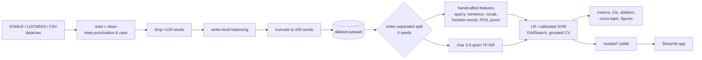
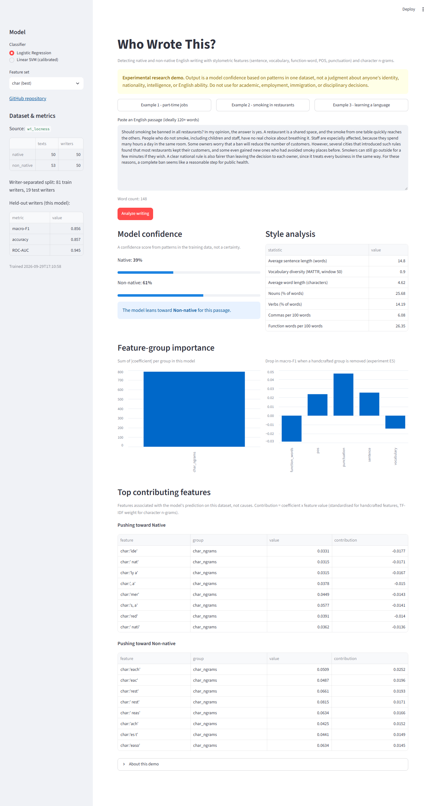

# Native or Non-Native? A Stylometric Approach to English Writer Classification

*"Who Wrote This?" — Detecting Native and Non-Native English Writing*

[](https://github.com/shivv-14/stylometry-native-classifier/actions/workflows/tests.yml)


This project asks whether an anonymous English passage can be classified as written by a
native or a non-native writer using only stylometric signals: sentence length, vocabulary
richness, function-word rates, part-of-speech distribution, punctuation, and character
n-grams. Logistic Regression and a Linear SVM are compared on a writer-balanced learner
corpus (ICNALE, whose native and learner groups answer the same prompts) using a
**writer-separated** evaluation, so every test essay comes from a person the model has
never seen. Majority-class and length-only baselines, a document-level split that shows how
much writer leakage inflates scores, a feature-group ablation and a cross-topic test keep
the reporting honest. A Streamlit app shows the predicted class, model confidence, style
statistics and the features that drove the prediction.

> **Disclaimer.** Experimental research demo. Output is a model confidence based on
> patterns in one dataset, not a judgment about anyone's identity, nationality,
> intelligence, or English ability. Do not use for academic, employment, immigration, or
> disciplinary decisions.

## Research questions

- **RQ1** Can stylometric features distinguish native and non-native English writing?
- **RQ2** Do character n-grams perform better than handcrafted linguistic features?
- **RQ3** Does performance remain reliable when the test set contains unseen writers?

## Pipeline



## Data

**Current results use W&I+LOCNESS** (BEA-2019 release: Cambridge Write & Improve learner
essays with CEFR levels + LOCNESS native essays), which can be downloaded without
registration for non-commercial research and education:

```bash
python tasks.py download
```

It is a weaker design than ICNALE: only 50 native essays exist, and learners and natives
wrote on different prompts, so topic and genre are confounded with the label (see
[limitations](docs/ethics_and_limitations.md)). **ICNALE is still the recommended corpus**:
register, copy all `.txt` files (including the ENS native group) into `data/raw/icnale/`,
set `data.source: icnale`, and re-run. No fake data is ever generated; the corpora are
gitignored and never redistributed. Details in **[data/README.md](data/README.md)**.

## Setup

```bash
python -m venv venv
# Windows: venv\Scripts\activate    macOS/Linux: source venv/bin/activate
python tasks.py setup       # or: make setup
```

`tasks.py` works everywhere; the `Makefile` has the same targets for macOS/Linux.

## Running each step

| step | command | output |
|---|---|---|
| prepare data | `python tasks.py prepare` | `data/processed/dataset.parquet`, `data_summary.md` |
| train final models | `python tasks.py train` | `models/*.joblib`, `models/metadata.json` |
| run experiments + tables | `python tasks.py evaluate` | `reports/results/`, `reports/figures/` |
| app | `python tasks.py app` | Streamlit at http://localhost:8501 |
| tests | `python tasks.py test` | pytest |

Figures are written as PNG with matplotlib, or as SVG when matplotlib cannot load (for
example when Windows Smart App Control blocks its compiled extension).

Everything: `python tasks.py setup download prepare train evaluate test`
(or `make setup && make prepare && make train && make evaluate && make test`).

## Results

The table below is inserted automatically by `scripts/make_report_tables.py` from
`reports/results/results.csv`; nothing here is typed by hand. The full report, including
the leakage gap (E4), ablation (E5), cross-topic (E6, needs prompt metadata) and recall per L1 or proficiency level, is
[reports/results/results.md](reports/results/results.md). Figures are in
[reports/figures/](reports/figures/).

<!-- RESULTS:START -->
Mean ± std over 5 writer-separated splits.
Best by cross-validation: **char / lr**.

| ID   | experiment             | features    | model   | split   | variant   | macro-F1      | 95% CI (macro-F1)   | accuracy      | ROC-AUC       | F1 native     | F1 non-native   | precision (macro)   | recall (macro)   |   seeds |
|:-----|:-----------------------|:------------|:--------|:--------|:----------|:--------------|:--------------------|:--------------|:--------------|:--------------|:----------------|:--------------------|:-----------------|--------:|
| B0   | majority class         | none        | dummy   | writer  |           | 0.344 ± 0.000 | [0.244, 0.423]      | 0.524 ± 0.000 | 0.500 ± 0.000 | 0.000 ± 0.000 | 0.688 ± 0.000   | 0.262 ± 0.000       | 0.500 ± 0.000    |       5 |
| B1   | length only            | length      | lr      | writer  |           | 0.661 ± 0.078 | [0.438, 0.855]      | 0.686 ± 0.065 | 0.718 ± 0.072 | 0.750 ± 0.043 | 0.572 ± 0.115   | 0.788 ± 0.045       | 0.699 ± 0.062    |       5 |
| E1   | handcrafted (5 groups) | handcrafted | lr      | writer  |           | 0.688 ± 0.083 | [0.467, 0.874]      | 0.695 ± 0.077 | 0.751 ± 0.050 | 0.697 ± 0.118 | 0.679 ± 0.071   | 0.716 ± 0.081       | 0.699 ± 0.081    |       5 |
| E1   | handcrafted (5 groups) | handcrafted | svm     | writer  |           | 0.642 ± 0.040 | [0.414, 0.835]      | 0.648 ± 0.038 | 0.742 ± 0.050 | 0.644 ± 0.044 | 0.639 ± 0.075   | 0.659 ± 0.035       | 0.649 ± 0.035    |       5 |
| E2   | char n-grams           | char        | lr      | writer  |           | 0.846 ± 0.064 | [0.662, 0.971]      | 0.848 ± 0.063 | 0.895 ± 0.070 | 0.857 ± 0.055 | 0.836 ± 0.074   | 0.863 ± 0.054       | 0.852 ± 0.061    |       5 |
| E2   | char n-grams           | char        | svm     | writer  |           | 0.837 ± 0.072 | [0.649, 0.971]      | 0.838 ± 0.071 | 0.898 ± 0.060 | 0.846 ± 0.063 | 0.828 ± 0.082   | 0.848 ± 0.063       | 0.842 ± 0.069    |       5 |
| E3   | combined               | combined    | lr      | writer  |           | 0.748 ± 0.059 | [0.533, 0.930]      | 0.752 ± 0.056 | 0.831 ± 0.050 | 0.768 ± 0.051 | 0.728 ± 0.080   | 0.780 ± 0.051       | 0.757 ± 0.054    |       5 |
| E3   | combined               | combined    | svm     | writer  |           | 0.727 ± 0.069 | [0.512, 0.911]      | 0.733 ± 0.065 | 0.815 ± 0.061 | 0.755 ± 0.056 | 0.700 ± 0.093   | 0.765 ± 0.060       | 0.739 ± 0.062    |       5 |
<!-- RESULTS:END -->

### What the results say (read with the numbers above and in results.md)

- **RQ1**: every feature set beats the majority baseline on unseen writers, but the
  handcrafted features only slightly beat the **length-only** baseline, so much of their
  signal is text length and related surface properties.
- **RQ2**: character n-grams score highest. Their top features
  ([figure](reports/figures/)) are largely **topic and genre words**: *you, your, I, my*
  (letters and personal tasks in Write & Improve) versus *Brit…, This, has* (argumentative
  LOCNESS essays). On this corpus, part of the n-gram advantage is therefore the
  topic/genre difference between the two sources, not native-like style.
- **RQ3**: the document-level random split scores higher than the writer-separated split
  (E4), so letting a writer's essays appear in both train and test inflates results.
- **Fairness**: recall for learners falls as CEFR level rises; the most proficient
  learners are most often labelled "native" (see the proficiency table in results.md).
- The native class has only 50 essays, so the confidence intervals are wide. ICNALE, with
  the same prompts for both groups, is the better test of the research questions.

## App

```bash
streamlit run app/streamlit_app.py
```

Sidebar: choose Logistic Regression or calibrated SVM and the feature set (best by
cross-validation is selected by default); dataset and held-out metrics come from
`models/metadata.json`. Paste a passage (or use one of the built-in neutral examples) and
click **Analyze writing** to see model confidence, a style analysis panel,
feature-group importance and the top features pushing toward each class. Texts under 40
words are refused and texts under 120 words get a warning.

Tip: `http://localhost:8501/?example=2` opens the app with example 2 already analysed.



## Repository structure

```
configs/config.yaml          paths, seeds, split ratios, feature + model parameters
data/                        raw/ interim/ processed/ (gitignored) + README on obtaining data
src/stylometry/
  config.py                  load YAML, set seeds
  data/                      loaders (ICNALE, LOCNESS, CSV), clean, balance, split
  features/                  sentence, vocabulary, function_words, pos, punctuation,
                             char_ngrams, handcrafted (sklearn transformer)
  models/                    pipelines, train
  evaluation/                metrics, evaluate, plots
  explain/                   global/local explanations, group importance
  app_utils.py               input validation, style panel helpers
app/streamlit_app.py         demo app
scripts/                     prepare_data, run_experiments, make_report_tables
models/                      trained pipelines (gitignored) + README
reports/                     figures/, results/, model_card.md
docs/                        methodology, ethics_and_limitations, feature_dictionary
tests/                       unit tests + SYNTHETIC fixture (tests only)
tasks.py, Makefile           setup / prepare / train / evaluate / app / test
```

## Limitations

- One corpus, one genre (short argumentative essays), two prompts; results do not transfer
  to other kinds of writing.
- The native/non-native label is confounded with proficiency, L1, education, age, task
  conditions and editing. The model learns whatever separates the groups in this data.
- Explanations are associations in this dataset, not causes or rules of English.
- spaCy tools are trained on edited native text and make more errors on learner text.
- Short texts give unreliable estimates.

More in [docs/ethics_and_limitations.md](docs/ethics_and_limitations.md),
[docs/methodology.md](docs/methodology.md), [docs/feature_dictionary.md](docs/feature_dictionary.md)
and the [model card](reports/model_card.md).

## Author

B. Shiva Ganesh ([shivv-14](https://github.com/shivv-14))
