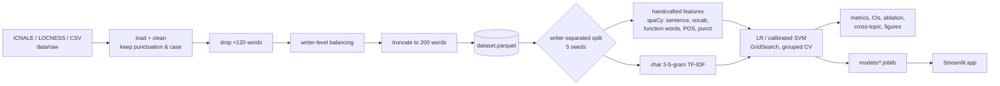

# Native or Non-Native? A Stylometric Approach to English Writer Classification

*"Who Wrote This?" — Detecting Native and Non-Native English Writing*

[](https://github.com/shivv-14/stylometry-native-classifier/actions/workflows/tests.yml)


This project asks whether an anonymous English passage can be classified as written by a
native or a non-native writer using only stylometric signals: sentence length, vocabulary
richness, function-word rates, part-of-speech distribution, punctuation, and character
n-grams. Logistic Regression and a Linear SVM are compared on a writer-balanced learner
corpus (ICNALE, whose native and learner groups answer the same prompts) using a
**writer-separated** evaluation, so every test essay comes from a person the model has
never seen. Majority-class and length-only baselines, a document-level split that shows how
much writer leakage inflates scores, a feature-group ablation and a cross-topic test keep
the reporting honest. A Streamlit app shows the predicted class, model confidence, style
statistics and the features that drove the prediction.

> **Disclaimer.** Experimental research demo. Output is a model confidence based on
> patterns in one dataset, not a judgment about anyone's identity, nationality,
> intelligence, or English ability. Do not use for academic, employment, immigration, or
> disciplinary decisions.

## Research questions

- **RQ1** Can stylometric features distinguish native and non-native English writing?
- **RQ2** Do character n-grams perform better than handcrafted linguistic features?
- **RQ3** Does performance remain reliable when the test set contains unseen writers?

## Pipeline



## Data

The corpora are licensed and must be requested by you; nothing is downloaded
automatically and no fake data is generated. See **[data/README.md](data/README.md)** for
exact steps. In short: register for ICNALE Written Essays, copy all `.txt` files (including
the ENS native group) into `data/raw/icnale/`, and check the file-name regex in
`configs/config.yaml`.

## Setup

```bash
python -m venv venv
# Windows: venv\Scripts\activate    macOS/Linux: source venv/bin/activate
python tasks.py setup       # or: make setup
```

`tasks.py` works everywhere; the `Makefile` has the same targets for macOS/Linux.

## Running each step

| step | command | output |
|---|---|---|
| prepare data | `python tasks.py prepare` | `data/processed/dataset.parquet`, `data_summary.md` |
| train final models | `python tasks.py train` | `models/*.joblib`, `models/metadata.json` |
| run experiments + tables | `python tasks.py evaluate` | `reports/results/`, `reports/figures/` |
| app | `python tasks.py app` | Streamlit at http://localhost:8501 |
| tests | `python tasks.py test` | pytest |

Everything: `python tasks.py setup prepare train evaluate test`
(or `make setup && make prepare && make train && make evaluate && make test`).

## Results

The table below is inserted automatically by `scripts/make_report_tables.py` from
`reports/results/results.csv`; nothing here is typed by hand. The full report, including
the leakage gap (E4), ablation (E5), cross-topic (E6) and per-L1 recall, is
[reports/results/results.md](reports/results/results.md). Figures are in
[reports/figures/](reports/figures/).

<!-- RESULTS:START -->
_Not generated yet. Add the corpus to `data/raw/` and run `python tasks.py prepare train evaluate`._
<!-- RESULTS:END -->

## App

```bash
streamlit run app/streamlit_app.py
```

Sidebar: choose Logistic Regression or calibrated SVM and the feature set (best by
cross-validation is selected by default); dataset and held-out metrics come from
`models/metadata.json`. Paste a passage (or use one of the built-in neutral examples) and
click **Analyze writing** to see model confidence, a style analysis panel,
feature-group importance and the top features pushing toward each class. Texts under 40
words are refused and texts under 120 words get a warning.

Screenshots will be added in `docs/screenshots/` after the models are trained on the real
corpus.

## Repository structure

```
configs/config.yaml          paths, seeds, split ratios, feature + model parameters
data/                        raw/ interim/ processed/ (gitignored) + README on obtaining data
src/stylometry/
  config.py                  load YAML, set seeds
  data/                      loaders (ICNALE, LOCNESS, CSV), clean, balance, split
  features/                  sentence, vocabulary, function_words, pos, punctuation,
                             char_ngrams, handcrafted (sklearn transformer)
  models/                    pipelines, train
  evaluation/                metrics, evaluate, plots
  explain/                   global/local explanations, group importance
  app_utils.py               input validation, style panel helpers
app/streamlit_app.py         demo app
scripts/                     prepare_data, run_experiments, make_report_tables
models/                      trained pipelines (gitignored) + README
reports/                     figures/, results/, model_card.md
docs/                        methodology, ethics_and_limitations, feature_dictionary
tests/                       unit tests + SYNTHETIC fixture (tests only)
tasks.py, Makefile           setup / prepare / train / evaluate / app / test
```

## Limitations

- One corpus, one genre (short argumentative essays), two prompts; results do not transfer
  to other kinds of writing.
- The native/non-native label is confounded with proficiency, L1, education, age, task
  conditions and editing. The model learns whatever separates the groups in this data.
- Explanations are associations in this dataset, not causes or rules of English.
- spaCy tools are trained on edited native text and make more errors on learner text.
- Short texts give unreliable estimates.

More in [docs/ethics_and_limitations.md](docs/ethics_and_limitations.md),
[docs/methodology.md](docs/methodology.md), [docs/feature_dictionary.md](docs/feature_dictionary.md)
and the [model card](reports/model_card.md).

## Author

B. Shiva Ganesh ([shivv-14](https://github.com/shivv-14))
